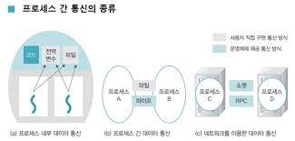

# 목차

-   [Chapter5. 프로세스 동기화](#chapter-5-프로세스-동기화)
    -   [1. 프로세스 간 통신](#1.-프로세스-간-통신)

# Chapter 5. 프로세스 동기화

-   개요
    -   독립적인 프로세스끼리 작업을 하다 서로 데이터를 주고받아야 할 때 `통신` 사용.
    -   프로세스 끼리 통신하는 경우 누가 먼저 작업할지, 언제 작업이 끝날지 등을 서로 알려주는 것 `동기화`
    -   같은 데이터를 여러 프로세스가 사용할 때 서로 침범하면 안되는 `임계구역`

## 1. 프로세스 간 통신

-   `프로세스 간 통신(IPC, Inter Process Communication)`: 프로세스간에 데이터를 주고받는 것. 같은 컴퓨터 내에 있는 프로세스 뿐만 아니라 네트워크로 연결된 다른 컴퓨터에 있는 프로세스와의 통신도 포함. - 운영체제 도움없이 진행되는 통신 방식: `전역 변수`, `파일` - 운영체제 도움으로 진행되는 통신 방식: `파이프`, `소켓`, `원격 프로시저 호출(RPC, Remote Procedure Call)`

    

