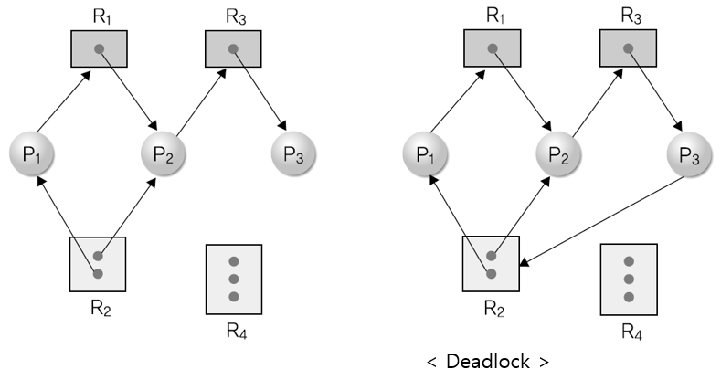

# Chapter 06 교착 상태

# Table of Contents

-   [1. 교착 상태의 개요](#1-교착-상태의-개요)

    -   [1-1. 교착 상태의 정의](#1-1-교착-상태의-정의)
    -   [1-2. 교착 상태의 발생](#1-2-교착-상태의-발생)
    -   [1-3. 자원 할당 그래프](#1-3-자원-할당-그래프)

-   [2. 교착 상태 필요 조건](#2-교착-상태-필요조건)
    -   [2-1. 교착 상태 필요조건](#2-1-교착-상태-필요조건)
    -   [2-2. 식사하는 철학자 문제와 교착 상태 필요조건](#2-2-식사하는-철학자-문제와-교착-상태-필요조건)
-   [3. 교착 상태 해결 방법](#3-교착-상태-해결-방법)

## 1. 교착 상태의 개요

### 1-1. 교착 상태의 정의

-   `교착 상태`: 2개 이상의 프로세스가 다른 프로세스의 작업이 끝나기만 기다리며 작업을 더 이상 진행하지 못하는 상태
    -   `아사 현상(starvation)`: 운영체제가 잘못된 정책을 사용해 프로세스의 작업이 지연되는 문제
    -   `교착 상태(deadlock)`: 여러 프로세스가 작업을 진행하다 보니 자연적으로 일어나는 문제. 운영체제는 교착 상태가 발생하면 강압적으로 해결해야 한다.

### 1-2. 교착 상태의 발생

-   시스템 자원, 공유 변수(파일), 응용 프로그램 등을 사용할 때 발생할 수 있다.

    -   시스템 자원
        -   교착 상태는 다른 프로세스와 공유할 수 없는 자원을 사용할 때 발생. 동시에 같이 사용할 수 없는 시스템 자원을 할당받은 후 양보하지 않는 경우 교착상태 발생가능.
    -   공유 변수

        -   교착 상태는 공유 변수를 사용할 때도 발생.

        ```
        boolean lock1=false;
        boolean lock2=false;

        // process 1
        lock1=true;
        // (1)
        while(lock2==true);
        	// 임계 구역
        lock1=false;

        // process 2
        lock2=true;
        // (2)
        while(lock1==true);
        	// 임계 구역
        lock2=false;
        ```

        -   (1), (2)위치에서 프로세스들이 멈췄다면 교착상태 발생.

    -   응용 프로그램
        -   데이터베이스 같은 응용 프로그램에서도 교착 상태가 발생. 여러 프로세스가 데이터 베이스에 저장된 데이터를 사용할 때는 데이터의 일관성을 유지해야 한다. 이런 데이터의 일관성을 유지하기 위해 잠금을 사용하는데 이 때 교착상태 발생 가능.

### 1-3. 자원 할당 그래프

-   `자원 할당 그래프(resource allocation graph)`는 프로게스가 어떤 자원을 사용 중이고 어떤 자원을 기다리고 있는지 방향성이 있는 그래프로 표현한 것.
    -   프로세스는 원, 자원은 사각형으로 표현

<p align="center">
	<label>
    	
		출처: https://gamball.tistory.com/m/23
	</label>
<p>

-   자원을 사용하고 있는 경우 자원으로부터 프로세스ㅗ 향하는 화살표로 표시
-   프로세스가 자원을 기다리는 경우 프로세스로부터 자원으로 향하는 화살표로 표시
-   하나의 자원을 동시에 사용하면 이를 `다중 자원(multiple resource)`라고 부른다. 다중 자원은 수용할 수 있는 프로세스 수를 사각형 안에 작은 동그라미로 표현.
-   식사하는 철학자 문제
    -   원형 식탁에 앉은 철학자들은 음식을 먹기 위해 왼쪽 포크를 잡은 뒤 오른쪽 포크를 잡아야만 식사를 할 수 있다. 이 때 학자들은 모두 왼쪽 포크를 집은 상태에서 오른쪽 포크를 집기위해 보지만 이미 다른 철학자가 왼쪽 포크로 사용하고 있기 때문에 음식을 먹지 못해 굶어 죽는다.
    -   식사하는 철학자 문제 중 교착 상태가 발생하는 조건
        1. 철학자들은 서로 포크를 공유할 수 없다.(상호 배제)
        2. 각 철학자는 다른 철학자의 포크를 뺏을 수 없다.(비선점)
        3. 각 철학자는 왼쪽 포크를 잡은 채 오른쪽 포크를 기다린다.(점유와 대기)
        4. 자원 할당 그래프가 원형이다.(원형 대기))

## 2. 교착 상태 필요조건

### 2-1. 교착 상태 필요조건

-   교착 상태 필요조건
    -   `상호 배제`: 한 프로세스가 사용하는 자원은 다른 프로세스와 공유할 수 없는 배타적인 자원이어야 함. 배타적인 자원은 임계구역으로 보호되기에 다른 프로세스가 동시에 사용할 수 없다.
    -   `비선점`: 한 프로세스가 사용 중인 자원은 중간에 다른 프로세스가 빼앗을 수 없는 비선점 자원이어야 함. 자원을 뺏을 수 없으면 공유할 수 없으므로 교착 상태 발생
    -   `점유와 대기`: 프로세스가 어떤 자원을 할당받은 상태에서 다른 자원을 기다리는 상태
    -   `원형 대기`: 점유와 대기를 하는 프로세스 간의 관계가 원을 이루어야 한다. 특정 자원에 대해서 점유와 대기를 한다고 해서 모두 교착 상태에 빠지는 것은 아님. 점유와 대기를 하는 프로세스들이 서로 방해하는 방향이 원을 이루면서 프로세스들이 서로 양보하지 않기 때문.

*   **교착상태는 상호 배제, 비선점, 점유와 대기, 원형 대기를 모두 충족해야 발생하고, 이 중 단 하나라도 충족하지 않으면 발생하지 않는다. 따라서 이 네 가지 조건을 교착 상태 필요조건이라고 한다.**
*   `상호 배제`와 `비선점` 조건은 _자원이 어떤 특징을 가지는지_ 나타낸다. 자원을 동시에 공유할 수도 없고 중간에 빼앗을 수도 없다면 자원을 가진 프로세스가 자원을 내놓을 때까지 무작정 기다리는 교착 상태 발생. 즉 임계구역과 관련이 있다. 임계구역을 위해 잠금 장치를 사용하면 상호 배제와 비선점 조건이 보장된다. 이런 자원이 아래의 조건까지 더해지면 교착 상태 발생 가능.
*   `점유와 대기`, `원형 대기 조건`은 프로세스가 어떤 행위를 하고 있는지 나타냄. 프로세스가 자원을 점유 및 대기하고 있는 상태에서 다른 프로세스를 방해하는 방향이 원을 이루면 서로 양보하지 않기 때문에 교착상태 발생

### 2-2. 식사하는 철학자 문제와 교착 상태 필요조건

-   상호 배제: 이 문제에서 포크는 한 사람이 사용하면 다른 사람이 사용할 수 없는 배타적인 자원. 배타적인 자원을 여러 프로세스가 사용하는 경우 교착 상태 발생
-   비선점: 자원을 빼앗을 수 있다는 것은 시간 간격을 두고 그 자원을 공유할 수 있다는 의미이므로 상호 배제가 성립되지 않음. 즉 교착상태가 발생하지 않음.
-   점유와 대기: 한 철학자가 두 자원을 모두 점유하거나 기다리는 것은 서로 진행을 방해하는 것이 아니라, 현재 작업을 진행하는 쪽과 기다리는 쪽의 선후 관계를 만든다는 의미. 한 프로세스가 자원을 점유한 상태에서 다른 프로세스의 자원을 기다리면 서로 진행을 방해하는 상태가 됨 (교착 상태)
-   원형 대기: 원을 이룬다는 것은 선후 관계를 결정할 수 없어 문제가 계속 맴돈다는 의미. 점유와 대기를 하는 프로세스들이 원을 이루면 서로 진행을 방해하는 상태가 되므로 교착상태 발생.
-   `교착 상태`와 `아사 현상`은 다르다.
    -   `아사 현상`은 정책상 잘못이나 오류로 인해 특정 프로세스의 작업이 이루어지지 않는 것. 몇 번 이상 양보했따면 더 이상 양보하지 않도록 조정하는 에이징으로 해결 가능
    -   `교착 상태`는 정책상 잘못이나 오류가 없어도 자연적으로 발생. 즉 에이징으로, 정책을 바꿈으로써 막을 수 없다. 아사 현상보다 처리하기가 복잡.

## 3. 교착 상태 해결 방법
